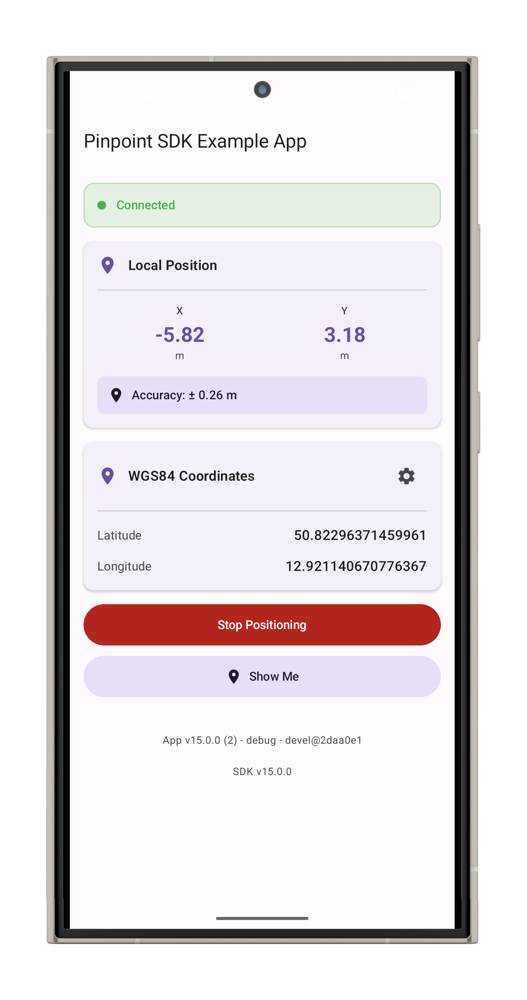

# Pinpoint SDK

* [Introduction](#introduction)

* [Use cases](#use-cases)

* [Features](#features)

* [Requirements](#requirements)

  * [General Requirements](#general-requirements)

  * [Requirements for Positioning with a TRACElet](#requirements-for-positioning-with-a-tracelet)

  * [Requirements for Positioning with Native UWB](#requirements-for-positioning-without-a-tracelet)

  * [Getting Started](#getting-started)

  * [Integration](#integration)

    * [Required Permissions](#required-permissions)

      * [General Permissions](#general-permissions)

      * [Positioning with Native UWB](#positioning-with-native-uwb)

      * [Positioning in the Background](#positioning-in-the-background)

  * [Usage](#usage)

  
* [Troubleshooting](#troubleshooting)

  * ["I do not get any positions"](#i-do-not-get-any-positions)


* [License](#license)


## Introduction
The Pinpoint SDK is an Android library for [FiRa](https://www.firaconsortium.org/) compliant Ultra-Wideband (UWB) positioning with [Pinpoint's](https://pinpoint.de) technology.

## Use cases 
The Pinpoint SDK can be used to integrate our indoor positioning system into your own solutions.

## Features
* Indoor Positioning for GNSS/GPS denied areas with Pinpoint's [SATlets](https://www.pinpoint.de/en/products/hardware/satlet)
* Uses Android's [UWB DL-TDOA API](https://developer.android.com/about/versions/17/features#dl-tdoa-api-android-17)
* Accuracy of up to 30 cm
* Simple Integration
* This SDK uses Google's `Task<T>` API for asynchronous operations. Refer to the [official Google documentation](#https://developers.google.com/android/guides/tasks) for the usage.


### Requirements
#### General Requirements
- An operational indoor site configured with Pinpoint's EasyPlan, including its site ID
- A `.bin` file that was created with EasyPlan (see the EasyPlan manual for details)
- A valid license key and access to Pinpoint's SDK repository

With the Pinpoint [Starter Kit](https://www.pinpoint.de/en/products/hardware/prototyping-kit) you can easily start with your integration.

#### Requirements for Positioning with a TRACElet
- A Pinpoint TRACElet
- Minimum Android 10 (API level 29)

#### Requirements for Positioning with Native UWB
  - Minimum Android 17 (API level 37)
  - A phone with native UWB DL-TDoA support, e.g. Google Pixel 8 Pro, 9 Pro or 10 Pro


## Getting started

| Android Example App | 
|:---:|
|  |
| *Pinpoint Android SDK Example App showing local position* |


Refer to the example app for an easy integration of the SDK. 
Add the following to your `local.properties` to be able to build it:
  ```properties
    # Add your credentials to access Pinpoint's SDK repository
    PINPOINT_USER=<yourUserName>
    PINPOINT_PASSWORD=<yourPassword>
    # Add your license key
    PINPOINT_API_KEY=<yourLicenseKey>
  ```


## Integration
Add the Pinpoint SDK to your build.gradle to use it:

``` gradle
dependencies {
    def sdkVersion = "15.0.1"
    implementation("de.pinpoint.android:sdk:$sdkVersion")
}
```

### Required Permissions
#### General Permissions
You'll need to add the following permissions to your Android Manifest.

``` xml
    <uses-permission android:name="android.permission.ACCESS_COARSE_LOCATION"/>
    <uses-permission android:name="android.permission.ACCESS_FINE_LOCATION"/>
    <!--    Needed to for the license key check-->
    <uses-permission android:name="android.permission.INTERNET" />
    <uses-permission android:name="android.permission.ACCESS_NETWORK_STATE" />

    <!-- For Android 11 and below -->
     <uses-permission android:name="android.permission.BLUETOOTH"
                     android:maxSdkVersion="30" />
    <uses-permission
        android:name="android.permission.BLUETOOTH_ADMIN"
        android:maxSdkVersion="30"/>

    <!-- For Android 12 and above -->
    <uses-permission android:name="android.permission.BLUETOOTH_CONNECT" />
    <uses-permission
        android:name="android.permission.BLUETOOTH_SCAN"/>

```
#### Positioning with Native UWB
If you want to support positioning with native UWB, you also need this permission:
``` xml
    <uses-permission android:name="android.permission.RANGING" />
```
#### Positioning in the Background
To keep positioning active while the app is running in the background, you must implement a foreground service. For more information on implementing and starting a foreground service, refer to the example app and [Google's documentation](https://developer.android.com/develop/background-work/services/fgs).

You have to use the `connectedDevice` and `location` service types. The corresponding permissions must also be declared in your app's manifest:

``` xml
<uses-permission android:name="android.permission.FOREGROUND_SERVICE"/>
<uses-permission android:name="android.permission.FOREGROUND_SERVICE_LOCATION"/>
<uses-permission android:name="android.permission.FOREGROUND_SERVICE_CONNECTED_DEVICE"/> 
```

If your app needs to start the positioning service while running in the background, you must declare the following permission:

``` xml
<uses-permission android:name="android.permission.ACCESS_BACKGROUND_LOCATION"/> 
```


## Usage

1. Create a licensing callback. 
The licensing callback handles cases where offline positioning is not possible because no valid tokens are available. By default, tokens remain valid for two weeks and are automatically refreshed if an internet connection is available.

    ```kotlin
    val licensingCallback = object: PinpointLicensingCallback() {

      override fun onTokenExpired() {
          // Do something
      }

      override fun onTokenExpiringSoon(expiringIn: kotlin.Long) {
          // Tell the user to turn on the internet to refresh the tokens for positioning
      }

    }
    ```

2. Get a client for the Pinpoint SDK:
    ``` kotlin
    PinpointLocationServices.getPinpointLocationProviderClient(
          this,
          "Your API key",
          licensingCallback
      ).addOnCompleteListener { task ->
          if (task.isSuccessful) {
              val client = task.result
              // do something with the client
              
          } else {
              val exception = task.exception
              // do something with exception
          }
      }
    ```


3. Make sure that all necessary [permissions](#permissions) are granted.

4. Make sure that you have your `.bin` file available as a ByteArray.

5. **Optional** if you want to support TRACElets: Tell your app users to hold their phone close to the TRACElet and call `connectTraceletIfNeeded`. 

    ```kotlin
    val traceletTask = indoorLocationClient.connectTraceletIfNeeded()
      // handle the result of the task
    ```

    Note: You can use the property `isUwbNativeSupported` of your client instance to determine whether a TRACElet is required.

6. Send the bin file of your site to your client and set the site ID:

    ``` kotlin
    val siteTask = indoorLocationClient.sendBinFile(binFile).onSuccessTask {
          indoorLocationClient.setSiteId(siteID)
    }
    siteTask.addOnCompleteListener { task ->
        if (!task.isSuccessful) {
            // do something with task.exception
        } else {
            // continue
        }
    }

    ```

7. Create a location callback and override the necessary methods:
    * `onLocationUpdate`is called whenever a new location was determined
    * `onLocationAvailability` is called when any of the preconditions that are needed for positioning changes. Refer to the documentation of `PinpointLocationAvailability`for more details

    ```kotlin
    val locationCallback = object: PinpointLocationCallback() {
        override fun onLocationUpdate(location: Location) {
          // Do something with the location
        }

        override fun onLocationAvailability(locationAvailability: PinpointLocationAvailability) {
            // check if a TRACElet needs to be reconnected
            if(locationAvailability.isSetupRequired()) {
                // show a dialog to tell users to turn on their TRACElet, then call indoorLocationClient.connectTraceletIfNeeded()
            }
        }

    }
    ```


8. Create a location request.

    ```kotlin
    val locationRequest = PinpointLocationRequest.Builder().build()
    ````

9. Call `client.requestLocationUpdates` with your client, your location callback, your location request, and a Looper to start positioning:

    ```kotlin
    indoorLocationClient.requestLocationUpdates(
        locationRequest,
        locationCallback,
        Looper.getMainLooper()
    )
    ```

10. Call `indoorLocationClient.removeLocationUpdates` with the request from 8.  or  `indoorLocationClient.stopProvider()` to stop positioning.

    10.a. removeLocationUpdates:
        
    ```kotlin
    indoorLocationClient.removeLocationUpdates(request)
    ```
        
    Make sure to use the same request like in 9. If you are using a TRACElet, it will stay connected to the phone.
    
    10.b. stopProvider:
    ```kotlin
    indoorLocationClient.stopProvider()
    ```
    This removes all running location requests and stops the connection to your TRACElet if applicable. Call this function if your app does not support background positioning. 


## Troubleshooting
### "I do not get any positions"
- Make sure that none of your tasks finished with an exception.
- Make sure that you have enabled both Bluetooth and the Location service.
- Make sure that you have called `client.connectTraceletIfNeeded` and that the task was successfully completed.
- Make sure that you sent a `.bin` file to your TRACElet or UWB enabled phone.
- Make sure that you set the correct site ID.
- Make sure that you requested all the [required permissions](#required-permissions).


## License
This library is licensed under a proprietary license. Please refer to the LICENSE file for more details.
